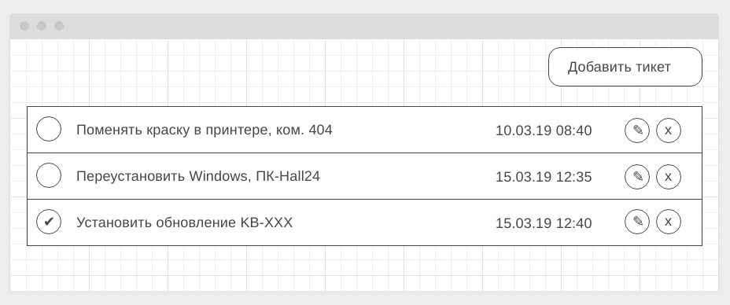

# Менеджер тикетов

Простое браузерное приложение для управления задачами и тикетами через HTTP API.

## Возможности

- Просмотр списка тикетов
- Создание, редактирование и удаление задач
- Отметка задачи как выполненной
- Авто-обновление интерфейса после изменений на сервере
- Модальные окна для управления задачами

## Технологии

- JavaScript (ES6+)
- DOM API
- CSS
- Webpack
- ESLint (Airbnb config)
- Node.js
- Express
- HTTP API

## CI/CD

- GitHub Actions - автоматическая проверка и сборка клиентской части (CI)  
- GitHub Pages - деплой клиентской части приложения (CD)  
- Render.com - хостинг серверной части приложения (не автоматический деплой)

## Архитектура

Приложение построено по клиент-серверной архитектуре.  
Клиент отправляет HTTP-запросы, сервер отвечает данными в формате JSON.
